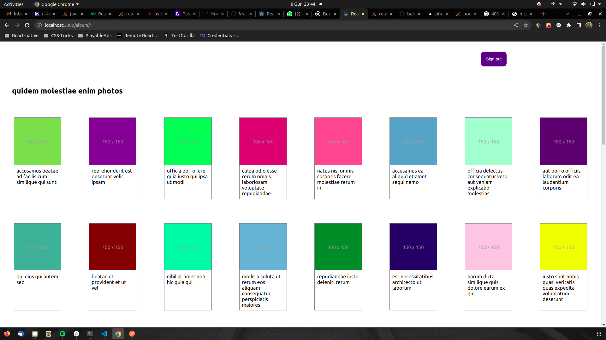

# PHOTO GALLERY

An application that shows a users photo albums and an albums photos. It also provides the user woth a method to update a photo title using a patch to the back-end and updates the front-end The app uses react for the front-end and fetches data from the typicode API.

#### By **Denis** created on, 08th February 2023

## Screenshot
   


## Table of Content

- [Description](#description)
- [Behavior of the website](#siteBehavior)
- [Development and set up](#setUp)
- [Prerequisites](#Prerequisites)
- [Live link](#Live-Link)
- [Technology Used](#technology-Used)
- [Licence](#licence)
- [Authors Info](#Authors-info)

## Description

An application that shows user photo albums and an albums photos. The app uses react for the front-end and fetches data from the typicode API. The app also provides functionality to edit photo titles.


## Behaviour of the website
### View
+ The website is visually appealing.
+ This is a single page website.
+ Upon loading the application prompts the user to sign up using existing google accounts in the browser and maintains user sessions.
+ The app shows a list of users in the application and number of albums they each have in a table. On clicking a specific user it displays more details about the user.
+ The user albums page shows a list of all albums belonging to a particular user. Clicking an album renders all photos in the selected album in cards.
+ The album photos page renders an albums photos in cards showing the title and an image. Clicking a card allows one to edit the title of the photo.
+ The photo page allows a user to edit a photo's title.
+ A sign out button allows a user to leave the application and return to the home page


## Development and Setup.

### prerequisites
+ First clone the project to your computer. ```git clone <repo url>``` or move to where the app folder is.
+ Ensure you have text editor such as Vs code installed.
+ Extract the files and open them in the editor.
+ Run npm install to install dependencies.
+ Run npm start to run the react application.


### Live Link
* The live link for the project is https://photo-gallery-ashy.vercel.app/

## Technology and Tools Used

+ HTML5
+ CSS5 - styling the application
+ React Js - logic of the application
- Git - Version control
- Vs code- Code editor


## Licence
MIT License

Copyright (c) [2023] [Denis Kariuki]

Permission is hereby granted, free of charge, to any person obtaining a copy
of this software and associated documentation files (the "Software"), to deal
in the Software without restriction, including without limitation the rights
to use, copy, modify, merge, publish, distribute, sublicense, and/or sell
copies of the Software, and to permit persons to whom the Software is
furnished to do so, subject to the following conditions:

The above copyright notice and this permission notice shall be included in all
copies or substantial portions of the Software.

THE SOFTWARE IS PROVIDED "AS IS", WITHOUT WARRANTY OF ANY KIND, EXPRESS OR
IMPLIED, INCLUDING BUT NOT LIMITED TO THE WARRANTIES OF MERCHANTABILITY,
FITNESS FOR A PARTICULAR PURPOSE AND NONINFRINGEMENT. IN NO EVENT SHALL THE
AUTHORS OR COPYRIGHT HOLDERS BE LIABLE FOR ANY CLAIM, DAMAGES OR OTHER
LIABILITY, WHETHER IN AN ACTION OF CONTRACT, TORT OR OTHERWISE, ARISING FROM,
OUT OF OR IN CONNECTION WITH THE SOFTWARE OR THE USE OR OTHER DEALINGS IN THE
SOFTWARE.

## Author's info
Linked in - [Denis Kariuki]
